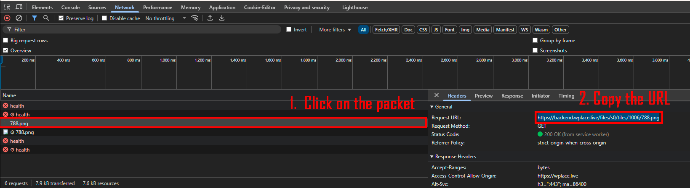
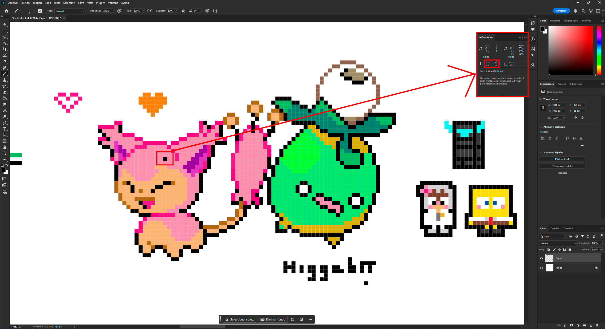
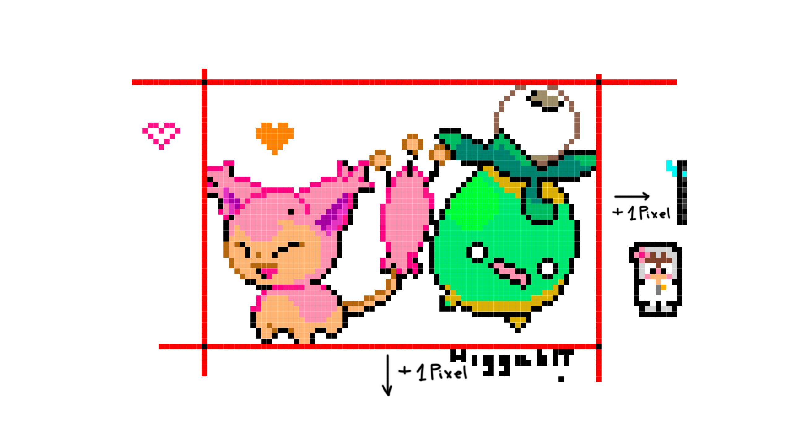

# wplace-alerter
This project implements a system to detect modifications to pixel art and instantly dispatch an alert via Discord webhook. Stay informed about all artistic changes with prompt, automated notifications.

# How to use
1. Fill the `data/arts_template.json` file with the desired configuration, including the Discord webhook URL and the arts to track.
2. Change the `data/arts_template.json` file to `data/arts.json` to start tracking the specified arts.
3. Run the `main.py` script to start the art tracking process.

## How to fill the template

1. **Discord Webhook**: Replace `YOUR_DISCORD_WEBHOOK` with your actual Discord webhook URL. This is where the alerts will be sent. [How to create a Discord webhook](https://support.discord.com/hc/en-us/articles/228383668-Intro-to-Webhooks)
2. **Cooldown Between Checks**: Set the `cooldown_between_checks` value to the desired number of seconds between each check for changes in the pixel art.
3. **Automated Checks**: Set the `automated_checks` value to `true` to enable automated checks for this art.
4. **Arts to Track**: In the `arts` array, add the pixel art files you want to monitor. Each entry should include:
    - **track**: Set to `true` to enable tracking for this art.
    - **check_transparent_pixels**: Set to `true` to check transparent pixels of the original art for changes.
    - **last_checked**: The timestamp of the last check.
    - **griefed**: Set to `true` if the art has been griefed (vandalized).
    - **api_image**: The URL of the image to track.
    - **start_coords**: The starting coordinates of the art in the pixel grid.
    - **end_coords**: The ending coordinates of the art in the pixel grid.

## How to get the API image

To get the API image URL, you can use the following steps:

1. Go to the Wplace website and navigate to the art piece you want to track.
2. Zoom in on the art piece.
3. Open the browser's developer tools (usually F12 or right-click and select "Inspect").
4. In the "Network" tab, look for the image file (it should have a .png extension) and right-click on it to copy the image address.

## How to get coordinates

To get the coordinates for the art piece you want to track, follow these steps:

1. Download the image.
2. Use a program like Photoshop or GIMP to open the image.
3. Use the ruler tool or grid to find the coordinates of the area you want to track.

It's important to note that the final coordinates should include an additional pixel.

## How to semi-auto fix

1. Open "Sources" in the browser's developer tools.
2. Install the extension Violentmonkey.
3. [Install the hook script](TODO)
4. Go to the console and paste the discord fixer command every time you want to fix an art :3

# TODO
- Add tool to get coordinates automatically
- Fixing process ???